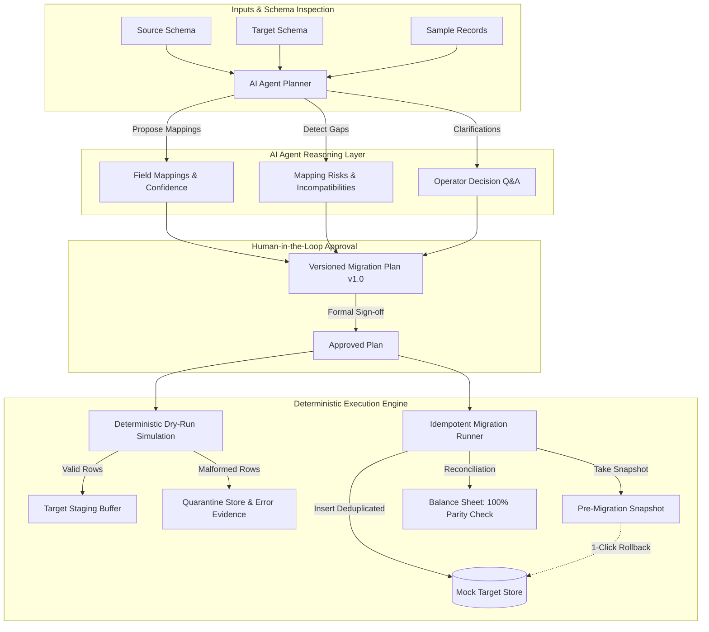

# 🚀 DataPlane — Agentic Data Migration Planner & Reconciliation Workbench

[](file:///d:/AsyncTask)
[](file:///d:/AsyncTask)
[](file:///d:/AsyncTask)

> **DataPlane** is an enterprise-grade agentic data migration workbench designed to safely plan, dry-run, execute, and reconcile datasets between divergent schemas with zero data loss and automated quarantine tracking.

---

## 🏛️ System Architecture



---

## ✨ Key Features & Completed Scope

| Feature Area | Implementation Details |
| :--- | :--- |
| **🤖 AI Schema Planner** | Semantic matching for composite names (`full_name` $\to$ `first_name`, `last_name`), unformatted phone to E.164 (`phone_e164`), legacy dates to ISO 8601 (`YYYY-MM-DD`), status enum lookups, and dollar-to-cents type casting. |
| **🛡️ Risk & Clarifications** | Proactively identifies missing required fields, non-conformant regexes, and asks operators structured clarification questions. |
| **👥 Human-in-the-Loop Approval** | Versioned migration plans (`v1`, `v2`) requiring formal operator sign-off before data execution is permitted. |
| **🧪 Deterministic Dry-Run** | Simulates full transformations without side effects, displaying live accepted vs quarantined counts, throughput latency, and sample target previews. |
| **🚨 Quarantine Diagnostics** | Isolates non-conforming rows with field-level error codes (`INVALID_PHONE_E164`, `REQUIRED_FIELD_MISSING`, `INVALID_DATE_FORMAT`) and one-click CSV export. |
| **🔒 Idempotent Retries** | Uses idempotency tokens (`IDEM-...`) to prevent duplicate insertions when migrations are retried. |
| **⏪ 1-Click Rollback** | Atomic snapshot-based rollback restores the mock target database to its clean pre-migration state instantly. |
| **📊 Source-to-Target Reconciliation** | Real-time balance sheet comparing source totals vs inserted vs quarantined rows to prove zero data loss. |
| **📜 Immutable Audit Trail** | Chronological log of AI proposals, user approvals, dry runs, retries, and rollbacks. |

---

## 📂 Preloaded Dataset Scenarios

DataPlane includes 3 ready-to-test scenarios:
1. **E-Commerce CRM to Modern Identity (`legacy_crm_customers` $\to$ `identity_accounts_v2`)**
   - Tests composite name splitting, unformatted phone cleanup, age derivation, enum mapping, and intentional malformed row detection.
2. **Healthcare Hospital EHR to FHIR Patient Records (`ehr_patients_v1` $\to$ `fhir_r4_patient`)**
   - Tests clinical patient record standardization, gender enum mapping, and telecom normalization.
3. **FinTech Transaction Ledger Migration (`old_journal_entries` $\to$ `settlement_ledger_v2`)**
   - Tests Unix epoch timestamp conversion, currency uppercase normalization, and float-to-cents integrity.

---

## 🚫 Excluded Scope (As Specified in Problem Statement)

As designated by the assessment requirements, the following are intentionally out of scope:
- Live production cloud database write connectors (e.g. AWS RDS/Snowflake live credentials).
- Arbitrary user-submitted runtime Python/code execution for transformations.
- Distributed big-data streaming engines (Kafka/Spark).

---

## 🚀 Quickstart & Setup

### Prerequisites
- **Node.js**: v18.0.0 or higher
- **npm**: v9.0.0 or higher

### 1. Clone & Install Dependencies
```bash
# Install root, client, and server dependencies in one command
npm run install:all
```

### 2. Run in Development Mode
```bash
# Starts backend server (port 3001) and Vite client (port 5173) concurrently
npm run dev
```
Open **[http://localhost:5173](http://localhost:5173)** in your browser.

### 3. Run Automated Tests
```bash
npm run test --prefix server
```

---

## 🚢 Production Build & Deployment

### Build Bundle
```bash
npm run build
```

### Start Production Server
```bash
npm start
```
The server serves the compiled React application directly on port `3001` (or `$PORT` on cloud platforms).

---

## 🧪 Test Suite Coverage

The project includes 9 unit & integration test suites verified with `vitest`:
- `transformation.test.ts`: Validates string splitting, E.164 phone formatting, date normalization, age derivation, and type casting.
- `dryRunAndQuarantine.test.ts`: Validates quarantine error classification, missing field detection, and field-level error diagnostics.
- `idempotencyAndRollback.test.ts`: Validates duplicate execution suppression via idempotency tokens and atomic pre-migration snapshot rollbacks.
